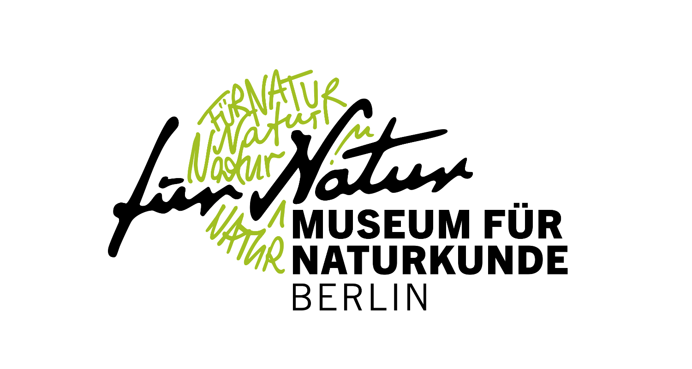
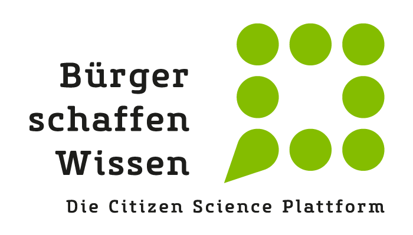

Die vom FOSSGIS e.V., der [Technischen Universität Berlin](https://www.tu.berlin/klima) und der [Kleingartenkolonie "Am Stadtpark I" e.V.](https://www.kolonie-am-stadtpark.de) eingereichte
Ideenskizze  ***Grüne Oasen oder Nachverdichtung? – Wirkung innerstädtischer Grünanlagen auf das Stadtklima*** hat es unter die zehn Finalist&ast;innen
des Wettbewerbs ["Auf die Plätze! Citizen Science in deiner Stadt"](https://www.citizenscience-wettbewerb.de/) geschafft.

Bis Ende Juli soll die Idee zu einem Konzept weiterentwickelt werden.  Drei der Vorhaben werden im September von der Jury ausgezeichnet und erhalten ein Preisgeld, um ihre Idee zu verwirklichen. Die Umsetzungsphase ist dann vom Oktober 2023 bis September 2024.

## Unsere Ideenskizze als Schlaglicht

Der Klimawandel begünstigt extreme Hitzeereignisse mit erheblichen Auswirkungen auf städtische Gebiete. Innerstädtisches Grün wie beispielsweise Kleingärten
haben ein hohes Potenzial, diese Auswirkungen abzumildern. Wir möchten wissen, wie Stadtgrün Hitzewellen für die Menschen erträglicher macht, indem es z.B. die Stadt kühlt.
Eine Antwort auf diese Frage liefern aussagekräftige Analysen zum innerstädtische Mikroklima wie hochaufgelöste Modellrechnungen. Diese brauchen eine breite Datengrundlage.
Eine breitere Datengrundlage, als sie die öffentlich verfügbaren amtlichen Geodaten liefern. Wir schaffen diese Datengrundlage gemeinsam mit Bürger&ast;innen,  die mikroklimatisch
bedeutsame Dinge wie Bäume, Sträucher, Hecken,... aber Gebäudedetails wie Fassadenmaterialien oder Dachformen,... in ihrer näheren Umgebung in OpenStreetMap erfassen.Wir bringen interessierte Menschen, OpenStreetMapper&ast;innen, die OpenSource-Software-Community und Wissenschaftler&ast;innen zusammen, so dass alle gemeinsam an der Erforschung des Stadtklimas mitwirken können.

## Die Idee von Anfang an:

### Offene Geodaten...

Offene Geodaten, die von den Bundesländern in ihren Geodatenportalen zur Verfügung gestellt werden, bilden eine wichtige Grundlage für Stadtklimaanalysen. Dazu zählen öffentliche Kataster  wie das Amtliche Liegenschaftskatasterinformationssystem (ALKIS) oder öffentliche Baumkataster. Ebenso veröffentlichen die Länder Fernerkundungsdaten wie Luftbilder und daraus abgeleitete Geländemodelle.

### ...und was sie nicht enthalten

Amtliche Geodaten enthalten nur bestimmte Informationen, beispielsweise Grundrissdaten genehmigungspflichtiger Gebäude oder Straßenbäume bzw. Bäume in öffentlichen Grünanlagen. Lauben und Bäume in Kleingartenanlagen, aber auch Bäume auf Privatgrundstücken sind beispielsweise in der Regel nicht in  amtlichen Geodaten enthalten.

### OpenStreetMap

[OpenStreetMap](https://www.openstreetmap.org) ist eine offene Geodatenbank, die von einer großen, weltumspannenden Community erzeugt und gepflegt wird
(es ist gewissermaßen so etwas wie ein Wikipedia für Geodaten). Etwas in OpenStreetMap zu kartieren bedeutet, Datensätze
in dieser Datenbank anzulegen oder zu ergänzen, die dann ein einer Karte angezeigt werden können.  In großen Städten, wo
es viele OpenStreetMap-Beitragende (Mapper genannt) gibt, enthält OpenStreetMap sehr detaillierte Informationen, die
die öffentlichen Geodaten sehr gut ergänzen.

Die folgenden drei Kartenbeispiele zeigen einen Teil der Berliner Kleingartenkolonie "Am Stadtpark I"
(ein Klick auf den Link führt auf die interaktive Karte):
- [ALKIS](https://fbinter.stadt-berlin.de/fb/index.jsp?loginkey=zoomStart&mapId=wmsk_alkis@senstadt&bbox=386837,5815890,387152,5816170) als Beispiel für amtliche Geodaten
- [bildbasiertes Digitales Oberflächenmodell (bDOM)](https://fbinter.stadt-berlin.de/fb/index.jsp?loginkey=zoomStart&mapId=k_dom@senstadt&bbox=386855,5815904,387133,5816166) als Beispiel für die Information aus offenen Fernerkundungsdaten
- [OpenStreetMap-Karte](https://obstbaumkarte.de/#map=18/1484574.59/6887895.58/0)

Die OpenStreetMap-Karte besitzt einen viel höhren Detailgrad: Es sind die Umrisse der Lauben und die Parzellengrenzen eingezeichnet, beim Hineinzoomen erscheinen
einzelne Bäume und Sträucher mit Bezeichnung der Art.

### Das Beste aus beiden Welten

Bei den in OpenStreetMap erfassten Bäumen fehlen in der Regel die mikroklimatisch relevanten Parameter wie Höhe und Kronendurchmesser. Diese lassen sich mit Hilfe eines neu entwickelten machine-learning-basierten Verfahrens aus offenen Fernerkundungsdaten gewinnen, ebenso die Umrisse von Gebäuden. Die Verfahren wurden in zwei Vorträgen auf der diesjährigen [FOSSGIS-Konferenz](https://fossgis-konferenz.de/2023/) vorgestellt [[1](#1),[2](#2)] .  Mit den so erhaltenen Informationen über Baumstandorte, Baumhöhen und Baumkronendurchmesser können vorhandene OpenStreetMap-Daten vervollständigt werden. Die aus diesen Verfahren gewonnenen Daten können aber auch als Grundlage für die Kartierung weiterer Kleingartenkolonien und anderer innerstädtischer Grünanlagen in OpenStreetMap dienen.

### Und wozu Citzen Science und OpenStreetMap? Könnte man die Fernerkundungsdaten nicht auch direkt nutzen?

Aus Fernerkundungsdaten erhält man weniger Informationen als vor Ort. So erkennt man beispielsweise einen Laubbaum mit einer bestimmten Größe.
Vor Ort kann man zusätzlich die Baumart bestimmen, Stammumfang messen oder von Menschen in der Umgebung das Pflanzdatum in Erfahrung bringen.
Auch stellen Fernerkundungsdaten immer nur eine Momentaufnahme des Zeitpunkts der Datenerhebung dar (beispielsweise einer Befliegung bei Luftaufnahmen).
Aus anderen Projekten wissen wir, dass von einer aktiven vor-Ort-Community gepflegte Daten oftmals aktueller sind als von öffentlichen Stellen erhobene Datensätze.
Wir führen amtliche und Fernerkundungsdaten mit dem Wissen der Menschen vor Ort zusammen und erzeugen so einen wertvollen, vielfältig nachnutzbaren Datenschatz.

### Wie können wir daraus nun etwas über das Stadtklima lernen?

Die erhobenen Daten dienen als Grundlage für Analysen des innerstädtischen Mikroklimas. So können hochaufgelöste Modellrechnungen mit einem bisher noch nicht erreichten
Detaillierungsgrad durchgeführt werden. Hierzu kann das vom Deutschen Wetterdienst zur Verfügung gestellte Stadtklimamodell [PALM-4U](https://www.dwd.de/DE/leistungen/palm4u/palm4u.html) eingesetzt werden. Die im Rahmen unseres Projekts erhobenen Daten werden als sogenannte "static driver" in den Modellsimulationen berücksichtigt. Bäume können beispielsweise als Objekte mit einer bestimmten Größe und Blattdichte modelliert werden. Bei Gebäuden spielen die Grundrisse und Strahlungseigenschaften der
Fassaden (Albedo) eine Rolle. So können z.B. die Gartenlauben in einer Kleingartenkolonie mit in die Simulation einbezogen werden.

### Was haben die Bürger&ast;innen von dem Projekt?

Wir bringen Bürger&ast;innen, OpenStreetMap- und OpenSource-Communitys, Wissenschaftler&ast;innen und Stadtplaner&ast;innen zusammen. Die Bürger&ast;innen können eigene Forschungsfragen entwickeln, die im Projekt bearbeitet werden sollen. Sie können ihre eigenen Lebenswelterfahrungen mit dem in der Stadtklimaforschung bekanntem Wissen zusammenbringen und sich somit besser in Planungsprozesse einbringen.

### Und was bleibt, nachdem das Projekt abgeschlossen ist?

Zunächst eine verbesserte Datengrundlage zu mikroklimatischen Eigenschaften der Berliner Stadtlandschaft: Für die Stadtklimaanalyse
relevante Dinge sind in OpenStreetMap kartiert und stehen als Daten für Modellrechungen zur Verfügung.
Diese von den Bürger&ast;innen bei der OpenStreetMap-Kartierung ihrer Umgebung zusammengetragenen Informationen
stellen einen wertvollen Datenschatz dar. Gemeinsam mit der OpenStreetMap-Community sollen die Daten weiter aktuell
gehalten und ergänzt werden. So können die Daten vielfältig nachgenutzt werden, auch von Forschungsprojekten zu ganz anderen wissenschaftlichen
Fragestellungen. 
Die im Projekt entwickelten Konzepte lassen sich auf andere Kleingarten- bzw. Grünanlagen und auf andere Städte übertragen. Bürger&ast;innen, OpenStreetMap-Communitys und Wissenschaftler&ast;innen sollen überall zu ähnlichen Projekten ermutigt werden.
Im Projekt entwickelte Software soll als freie OpenSource-Software dauerhaft zur Verfügung stehen.
Messdaten, die im Rahmen des Projekts entstehen, beispielsweise zu Albedo oder Blattdichte, sollen gemäß der [FAIR](https://www.tu.berlin/ub/szf/informationen-tipps/leitlinien-empfehlungen)-Prinzipien dauerhaft verfügbar gemacht werden. 

## Ansprechpersonen:

- Oliver Rudzick csp@rudzick.de
- Katja Haferkorn info@fossgis.de

## Referenzen

[1] Weinmann, Anika; Krisztian, Lina; Metz, Markus; Krelaus, Leonie; Nießen, Inga-Mareike: Automatisierte Detektion von Baumstandorten in der Metropole Ruhr. FOSSGIS Konferenz 2023 : Berlin, 15. - 18. März 2023, FOSSGIS e.V. et al., 2023. [https://doi.org/10.5446/61099](https://doi.org/10.5446/61099)

[2] Krelaus, Leonie; Nießen, Inga-Mareike; Metz, Markus: Gebäudedetektion auf Basis von Luftbildern und Punktwolken des Regionalverbands Ruhr. FOSSGIS Konferenz 2023 : Berlin, 15. - 18. März 2023, FOSSGIS e.V. et al., 2023. [https://doi.org/10.5446/61139](https://doi.org/10.5446/61139)

